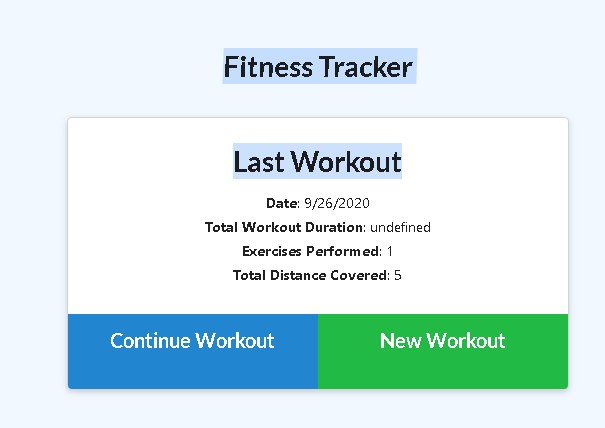
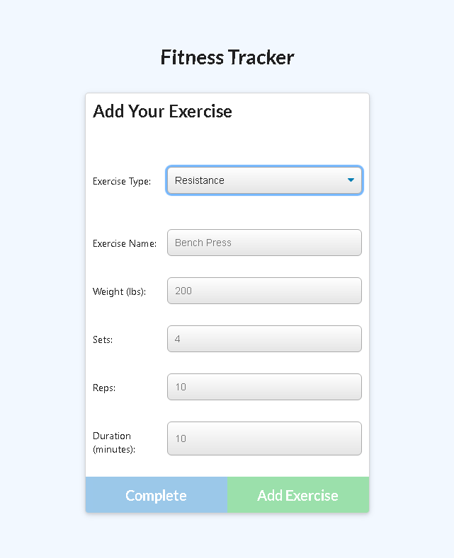
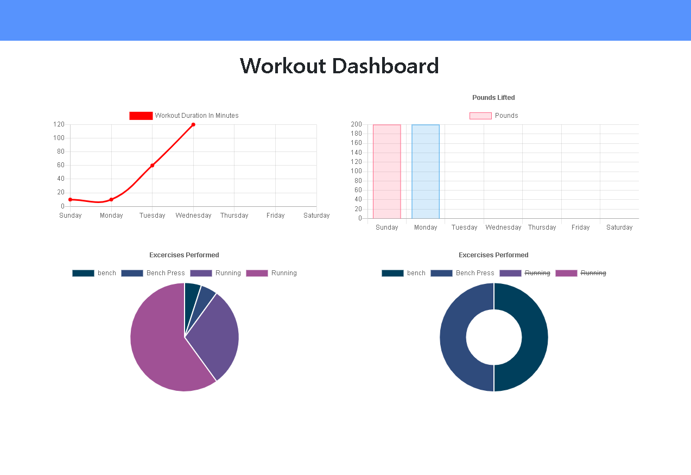

# Workout-Tracker
Workout Tracker that utilizes MongoDb, Node.js, Express Server and Javascript.
The app can be tested on heroku located <a href = "https://pacific-atoll-57564.herokuapp.com/">here.</a>

# Usage

The Workout Tracker lets you log your workout be it cardio or restance style workout. Once complete you can view your progress via a slick graphical interface. 

# How it works

The Fitness Tracker utilizes Node JS, Express Server and Mongo Db via Javascript to save workouts and recall them for display. 

When you login you will come to a screen as such.

You then chose the work out specification

Once complete you click on the dashboard link on the upper left to view your progress!
